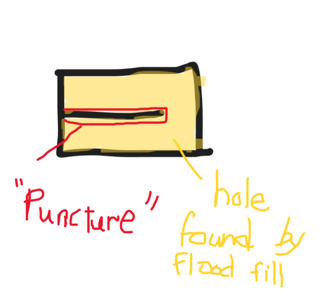
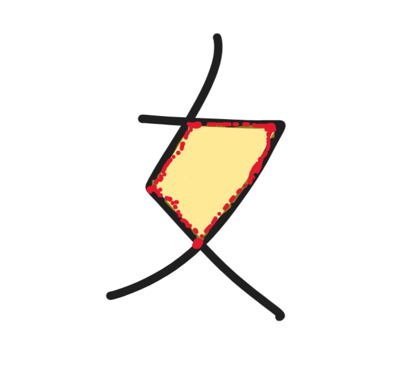

# GoodMorning


Given an image with the characters 早, 上, and 好 ("Good Morning" in Chinese), this program counts the number of occurrences of each character.
This project is inspired by the problem ["goodmorning" on codebreaker](https://codebreaker.xyz/problem/goodmorning), a Singapore-based competitive programming site.

It is assumed that:

1. The image is in black and white (or at least distinguishable via a grayscale threshold).
2. The characters are clearly separated and not touching.
3. In particular, when writing the character 早, the short horizontal stroke at the top (inside the 日 component) must be fully connected—touching both sides of the surrounding 口 shape. If the stroke doesn't connect properly, the program may miscount the number of holes.

## How it works

Briefly speaking, this algorithm works by converting the input image into a binary grid, where each pixel is marked as either black (`true`) or white (`false`) based on a grayscale threshold (set to 250 by default).
Then, it performs the following steps:

1. **Background Flood Fill**
    The algorithm first flood-fills (via a DFS) from the top-left corner of the image, marking all white pixels that are part of the background. This helps distinguish holes *inside* characters from empty space *outside* them.

2. **Shape Detection**
    It iterates over the grid to find connected components of black pixels (characters). For each unvisited shape, it calls a flood fill function to determine the which character each shape is.

3. **Hole Counting**
    While traversing each shape, it checks for any enclosed white regions (holes) not connected to the background. Each hole is detected and counted using another flood fill.

4. **Classification**
    Based on the number of holes:
    - `早` has **2 holes**
    - `好` has **1 hole**
    - `上` has **0 holes**  
The program tallies the count for each character accordingly.

## Example
The `source files` project folder contains two PNG sample images (`Sample1.png` and `Sample2.png` respectively) that you can test the program with.

## How to Use

1. Place the image inside the `source files` project folder.
2. Run the program.
3. Enter the filename when prompted.

```bash
cargo build --release
```
You'll be prompted to input the filename of your image (e.g., `Sample1.png`), and it will output the counts of each character.


## Dependencies
`image` for reading and decoding images.
If it isn't inside already, add this to your `Cargo.toml`:
```toml
image = "0.24"
```
## Potential Future Improvements

One potential improvement I’ve considered is refining the algorithm to better handle ambiguous cases— particularly those involving the character 早, where the short horizontal stroke inside the 日 component may not fully connect to both sides of the enclosing 口 shape.

### The Problem

In many handwritten cases, this horizontal stroke might only touch one side— or not connect at all. This causes the algorithm to misinterpret the structure of the hole, leading to incorrect classification.
However, I noticed that such incomplete strokes often create a distinctive geometric feature: a sharp "puncture" or indentation in the shape of the hole. This can be interpreted as a deviation from convexity.



By contrast, the hole in the 女 component of the character 好 tends to remain relatively convex—even when written awkwardly. This makes the structure more stable for detection under various handwriting styles.

### A Geometric Heuristic

To formalize this idea for a computer algorithm, I proposed the following approach:

**Given the points that make up a hole:**

- Compute its [**convex hull**](https://en.wikipedia.org/wiki/Convex_hull).
- Find the maximum length of a line segment that:
    1. starts at an edge of the convex hull, and is perpendicular to it.
    2. ends at a point within the convex hull that is **not** inside the hole itself.

If the longest such segment is **greater than one-fifth of the width** of the overall shape, it is likely the hole contains a deep puncture—indicative of an incomplete horizontal stroke in 早.
This heuristic allows us to differentiate between a true split (as in 早) and a naturally convex hole (as in 好).

Examples:

  


Of course, this is assuming the characters are "fairly well written", but after my many failed attempts at finding edge cases to this approach (including varying brush thickness, ungodly rotations, distortions that would require unthinkable handwriting to achieve), I am fairly confident in its correctness.

Other possible improvements that can be made would be to cover the case where the box-like shape at the top of the character 早 is not fully closed, but I believe such a case requires either adding more restrictions to the user input, or the usage of AI/Deep learning algorithms.

### Final Thoughts

Implementing this convexity-based detection algorithm would require significant additional work, including geometric processing (e.g., convex hull computation, segment casting). Nevertheless, I believe this could substantially improve the robustness of the character classification—especially for varied handwriting. (That being said, I have implemented [Graham's convex hull algorithm](https://en.wikipedia.org/wiki/Graham_scan) in C++ before...)

This is something I plan to explore and potentially implement in the future.
